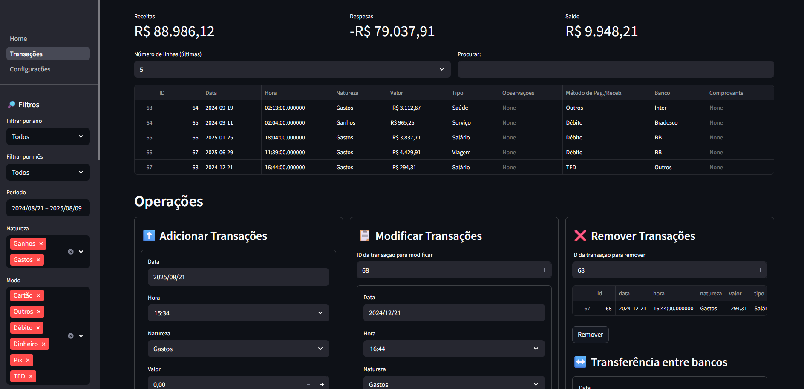

# ORÇAMENTO APP

Aplicação em **Python** para controle de orçamento pessoal, com suporte a importação e exportação de transações, além de visualização interativa de dados financeiros.

---

## Funcionalidades

- **Cadastro e gerenciamento de transações**
- **Importação e exportação** de dados em Excel
- **Relatórios e gráficos interativos**
- **Cálculos financeiros automáticos**
- **Configurações personalizáveis**
- **Banco de dados local (SQLite)** para armazenamento

---

## Inserção de Dados

Os dados podem ser inseridos manualmente por meio de formulários desenvolvidos em Streamlit ou importados de planilhas no formato data/upload/gastos_ganhos_exemplo_rand.xlsx.

---

## Visualização Gráfica

Na página inicial são exibidos gráficos (em plotly) que auxiliam no acompanhamento de receitas, despesas e balanço geral.

---

## Filtros de Consulta

A barra lateral disponibiliza filtros variados para refinar a visualização das transações, permitindo análises mais detalhadas.

# Imagens

## Home

## Transações

